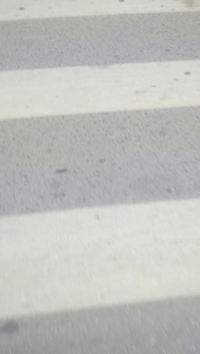

# Graduation-thesis
> This is an implementation of my graduation thesis at Hanoi University of Science and Technology (HUST). 
	

## Introduce
Use a smartphone while walking is very dangerous, especially when crossing the street. So that I proposed this thesis to recognize and alert if the user uses a smartphone while crossing. The final app will run in the background and do not affect the user in normal circumstances but uses a smartphone while crossing. 
This repo is an application that demos Zebra detection module. The point of view when the user uses smartphone will be processed and display to the screen. If crosswalk is detected, the screen will be changed to red

Image describes how user hold phone while walking (“ZebraRecognizer: Efficient and Precise Localization of Pedestrian Crossings”)

Some image to decribe the taken images when user uses smartphone while walking

## Installation
> This application was tested with Xiaomi Mi 4c (Android 5.1.1)
> You may need install OpenCV for Android to build. See more: https://medium.com/@kashafahmed/a-proper-beginners-guide-to-installing-opencv-android-in-android-studio-updated-5fe7f3399e1c

- Download OpenCV for Android, Android Studio, build and run project.
- Or download APK file at: https://github.com/ducbet/Graduation-thesis/raw/master/app/build/outputs/apk/debug/app-debug.apk
## Zebra crossing detection module
- This is the most importance part of the application. This part use OpenCV in C++ and connected to Android application via JNI
- The module tested with 9470 images:
- TP: 1244
- FP: 79 
- FN: 825
- TN: 7322
- Accuracy 94%
- Recall 60%
- Latency between the moment crossing appear and the moment the user receive alert alert: 873ms
- Frame rate: 11fps
## Features
- Demo zebra detection module with saved images
- Demo zebra detection module with the camera as input
## Usage (Optional)
- If you choose "DEMO BY CAMERA", you should go outside and test with real zebra crosswalk.
- If you choose "DEMO BY SAVED VIDEO", you must have splited images and put in your phone's external storages with path "./gr"
